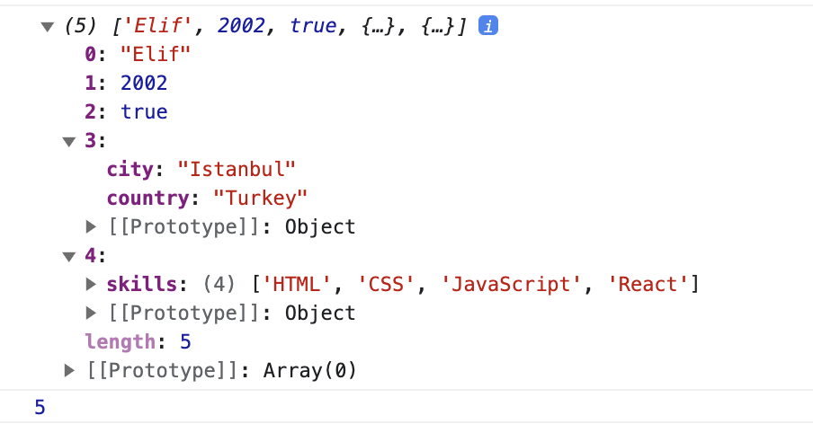

# 30-days-javascript

## 1. gun

### Giris yapildi

## 2. gun

### Veri turleri

## 3. gun

### Boolean, Operatorler ve Tarih Objesi

## 4. gun

### Donguler konusuna giris yapildi

- If
- If - Else
- If - Else If - Else
- Switch
- Ternary Operators

## 5. gun

### Diziler

**Bos dizi olusturma**
Bos dizi olusturmak icin bir cok yontem mevcuttur. Bunlardan 3 tanesini;

1. `const  arr = Array();`
2. `let arr = new Array();`
3. `const  arr = [];`
   seklindedir.

**Degerlere sahip bir dizi olusturma**

```
const numbers = [0, 3.14, 37, 98.6, 100] // sayı dizisi
const  webTechs = ['HTML', 'CSS', 'JS', 'React', 'MongDB'] // string dizisi, web teknolojileri
```

**Dizileri yazdirmak ve dizilerin uzunluklarini ogrenmek**

```
console.log('Numbers:', numbers)

console.log('Number of numbers:', numbers.length)
```

_Cikti:_

```
Numbers: [0, 3.14, 9.81, 37, 98.6, 100]

Number of numbers: 6
```

**Dizideki degerler farkli veri tiplerinde olabilir**

```
const arr4 = ["Elif",
    2002,
    true,
    { country: "Turkey", city: "Istanbul" },
    { skills: ["HTML", "CSS", "JavaScript", "React"] }
]
console.log(arr4);
console.log(arr4.length);
```

_Cikti:_


**Split kullanarak dizi olusturmak**
Split ile diziyi farkli sekillerde bolebilir ve diziyi degistirebiliriz.
Split kullanarak tek bir veri tanimladiysak yani veriyi virgullerle ayirmadiysak split ile string degerin her birini harf harf dizi olarak tanimlayacaktir.
Eger string olarak bir degisken tanimladiysak ve bu degiskenin icinde bir cok kelime virgullerle ayrilarak kullanildiysa kelime kelime olarak yeni bir diziye atar.

```
let js = "javascript";
const charsJavascript = js.split("");
console.log(charsJavascript);
```

_Cikti:_
`(10) ['j', 'a', 'v', 'a', 's', 'c', 'r', 'i', 'p', 't']`

```
let socialMedia = "Twitter,Instagram,Facebook,Google,Snapchat";
const socialMedias = socialMedia.split("");
console.log(socialMedias);
```

_Cikti:_

```
(42) ['T', 'w', 'i', 't', 't', 'e', 'r', ',', 'I', 'n', 's', 't', 'a', 'g', 'r', 'a', 'm', ',', 'F', 'a', 'c', 'e', 'b', 'o', 'o', 'k', ',', 'G', 'o', 'o', 'g', 'l', 'e', ',', 'S', 'n', 'a', 'p', 'c', 'h', 'a', 't']

```

```
const socialMedias2 = socialMedia.split(",");
console.log(socialMedias2);
```

_Cikti:_

```
(5) ['Twitter', 'Instagram', 'Facebook', 'Google', 'Snapchat']
```

```
let txt = "I love to JavaScript. I teach JavaScript, Html, Css"
const words = txt.split(" ");
console.log(words);
```

_Cikti:_
`(9) ['I', 'love', 'to', 'JavaScript.', 'I', 'teach','JavaScript,', 'Html,', 'Css']`

**Index kullanarak dizi elemanlarına ulaşmak**
index degerlerini kullanarak dizi elemanlarına ulaşabiliriz.

**Dizi elemanlarını düzenlemek**
Bir dizi degistirilebilir, yaratildiktan sonra eleman icerklerini degistirebiliriz

**Dizileri manüple edebilecek metotlar**
Baslica bu metotlar:

- Array
- length
- concat
- indexOf
- slice
- splice
- join
- toString
- includes
- lastIndexOf
- isArray
- fill
- push
- pop
- shift
- unshift

#### Array

Array:Bir dizi yaratmak için kullanılır.

#### fill ile statik degerler yaratmak

fill: Bütün dizi elemanlarını statik değerle doldurur.

#### Concat kullanarak dizileri birleştirmek

concat: İki veya daha fazla sayida diziyi birbiri ile birleştirir.

#### Length

Length:Dizi uzunluğunu bildirir.

#### indexOf

indexOf: O elemanın dizide olup olmadığını kontrol eder.Eğer o eleman dizide mevcutsa index numarasını, mevcut değilse -1 döner.
`fruits.indexOf('avocado')`
`numbers.indexOf(5)`

#### lastIndexOf

lastIndexOf: Dizideki son elemanın pozisyonunu verir. Eğer mevcutsa o elemanın index numarasını döner, mevcut değilse -1 döner.
`numbers.lastIndexOf(6)`

#### includes

includes:Bir dizide bir öğenin olup olmadığını kontrol etmek için kullanılır.Mevcut ise, true değerini döndürür, aksi takdirde false değerini döndürür.
`webTechs.includes('Node')`

**Diziyi kontrol etmek**

#### Array.isArray

Array.isArray: Veri tipinin bir dizi olup olmadığını kontrol etmek için kullanılır.
`Array.isArray(numbers)`

**Diziyi stringe çevirmek**

##### toString

toString:Diziyi string bir ifadeye çevirir.

##### join

join: Dizinin elemanlarını birleştirmek için kullanılır, join yönteminde ilettiğimiz argüman dizide birleştirilir ve bir dizi olarak döndürülür. Varsayılan olarak bir virgül ile birleşir, ancak elemanlar arasında birleştirilebilecek farklı dizi parametreleri iletebiliriz.

#### Slice

Slice: Bir aralıktaki çoklu elemanları dilimler İki parametre alır. Bu parametreler, başlangıç ve bitiş konumlarıdır. Bitiş konumunu dahil etmez.

#### Splice

Splice: üç parametre alır :başlangıç konumu, kaldırılması gereken eleman sayısı ve eklenmesi gereken eleman sayısı

#### Push kullanarak diziye eleman eklemek

Push: Dizinin sonuna eleman ekler.Varolan bir diziye eleman eklemek için push metodunu kullanırız.

#### Pop kıllanarak diziden eleman çıkarmak

Pop: Dizinin sonundaki elemanı siler.

#### Shift ile dizinin en başından eleman kaldırmak

shift: Dizinin en başındaki elemanı siler.

#### Unshift ile dizinin en başından eleman eklemek

unshift: Dizinin başına dizi elemanı ekler.

**Dizi sırasını terse çevirmek**

#### Reverse

reverse: Dizi sıralamasını terse çevirir.

**Dizi elemanlarını sıralamak**

#### Sort

sort: Dizi elemanlarını alfabetik sırada düzenleyin.Sort call back fonksyonu alır, sort'un call back fonksiyonu ile nasıl kullandığımızı ilerleyen bölümlerde göreceğiz.
